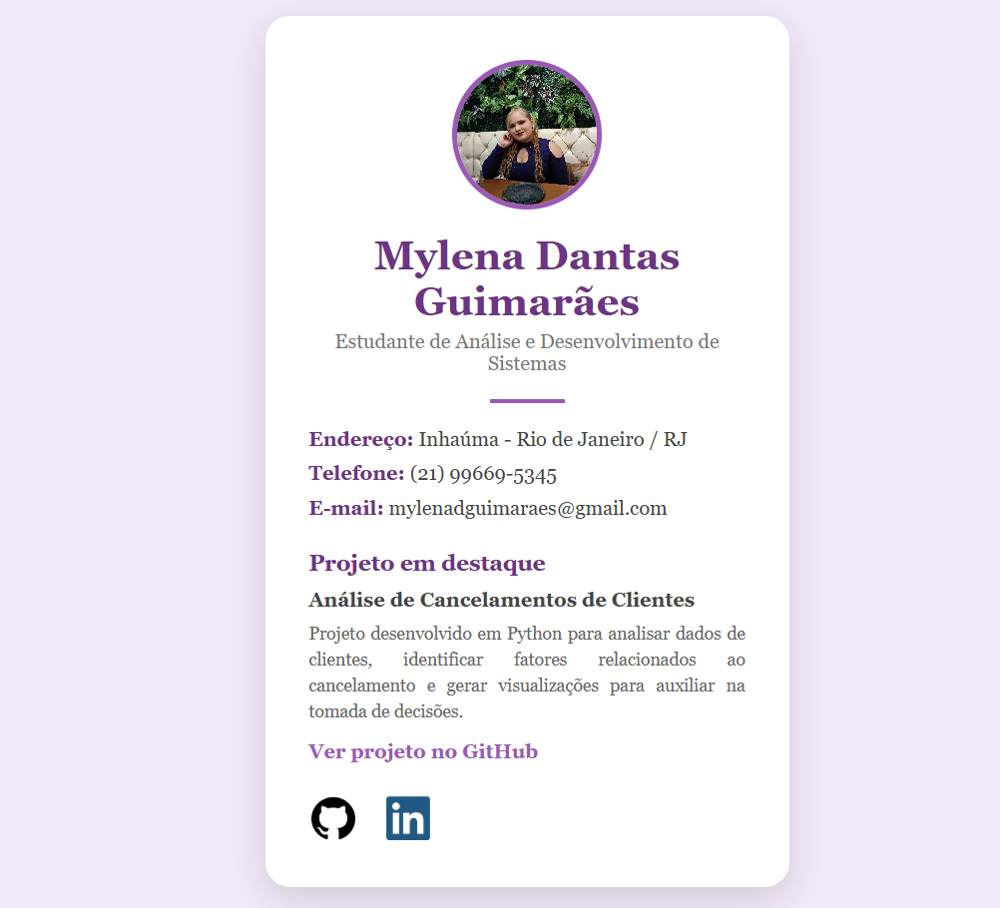

# Cartão de Visitas

Página web desenvolvida em **HTML** como atividade acadêmica para representar um cartão de visitas pessoal.

O projeto apresenta informações de contato, formação acadêmica, redes sociais e um projeto desenvolvido na área de tecnologia.

## Preview



## Sobre o projeto

O objetivo deste projeto foi desenvolver uma página simples que representasse um cartão de visitas digital.

A página contém:

* Nome
* Foto
* Atividade estudantil
* Endereço
* Telefone
* E-mail
* Redes sociais
* Projeto em destaque com link para o GitHub

## Tecnologias utilizadas

* HTML5

## Estrutura do projeto

```text
cartao-visitas/
│
├── index.html
└── img/
    ├── foto.jpeg
    ├── github.png
    ├── linkedin.png
    └── print-site.png
```

## Atividade estudantil

O cartão apresenta como projeto em destaque o **Análise de Cancelamentos de Clientes**, desenvolvido em Python.

O projeto utiliza análise exploratória de dados para identificar fatores relacionados ao cancelamento de clientes, utilizando tecnologias como **Python, Pandas, Plotly e Jupyter Notebook**.

[Ver projeto no GitHub](https://github.com/mylenadguimaraes-alt/Python_Analise_Cancelamentos)

## Autora

**Mylena Dantas Guimarães**

Estudante de Análise e Desenvolvimento de Sistemas.

---

Desenvolvido como atividade acadêmica de HTML.
